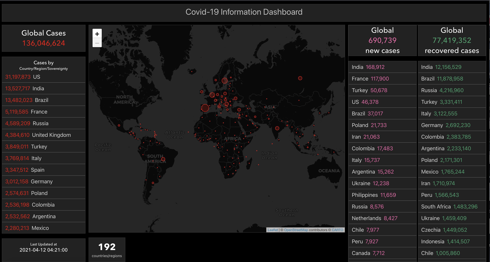

Project for learning purposes, it is a COVID-19 TRACKER project using React with Typescript.

A dashboard to visualize the activity of COVID-19 around the world.

Check it here: https://ferrikt.github.io/covid-tracker/

Thanks to Github for the hosting.

